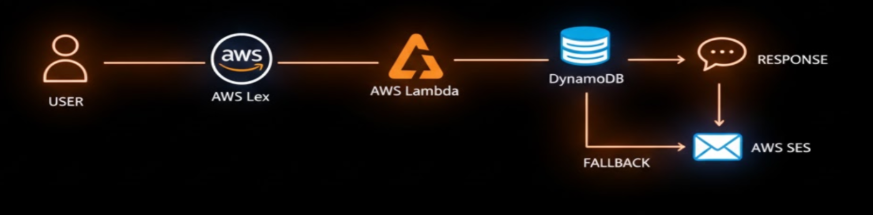

# AI Chatbot for IT Support (AWS)

A serverless IT support chatbot built using AWS services to automate responses for common technical issues such as password reset, Wi-Fi connectivity problems, and email access troubleshooting.

## Architecture

User → S3 Website → Amazon Lex → AWS Lambda → DynamoDB

## AWS Services Used

- Amazon Lex – Chatbot and natural language processing
- AWS Lambda – Backend serverless logic
- Amazon DynamoDB – FAQ knowledge base
- Amazon S3 – Static website hosting

## Example Queries

- reset password
- wifi not working
- email access issue

The chatbot retrieves answers from a DynamoDB FAQ table and responds automatically.

## Project Structure

aws-it-support-chatbot  
│  
├── lambda_function.py  
├── index.html  
├── architecture.png  
└── README.md  

## Author

Angelo Jose  
Computer Science Engineer
